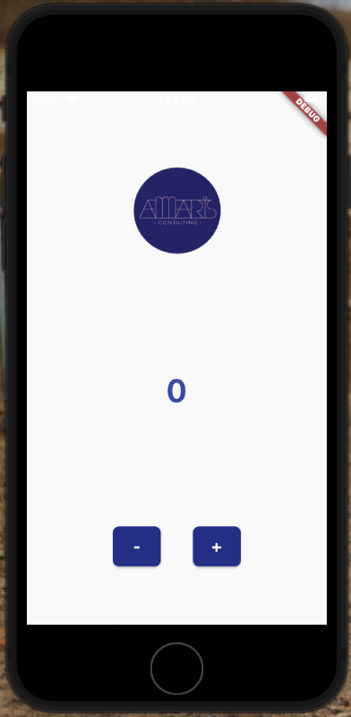

# Amaris Test

Buenas tardes les comparto el la prueba tecnica la cual consta de una aplcacion mobile desarrollada en Flutter bajo el lenguaje Dart en la que tenemos un contador que va aumentanto sefun las acciones del usuario

## Para ejecutar el proyecto

- Despues de clonado el repositorio ejecutar la siquiente intruccion

~~~
    flutter pub get
~~~

- luego solo es ejecutar el proyecto de

~~~
    flutter run
~~~

## Entorno de desarrollo
- Xcode : 13.1.2
- Visual Studio Code : 1.64.0-insider 
- SO : macOs Big Sur 11.4 (20F71)
- Flutter: 2.5.2
- Dart: 2.14.3

#

Quedo atento 

Gracias